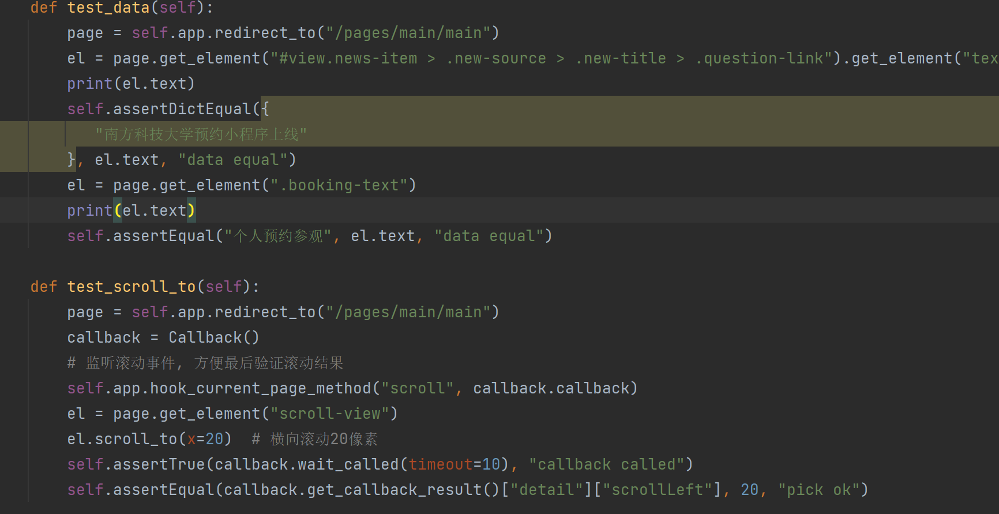

# [CS304] Team Project - Final delivery report

Project Name:___Visiting SUSTech (参观南科大)___

Project Member: <u>眭和、李嘉成、张海涵、李建霖、余坤屹</u>

GitHub Repositories: https://github.com/orgs/sustech-cs304-group/repositories

---

## 1 Metrics 

### Metrics of our project

**Backend**

* Lines of Code: 2868 (Only for Java classes)
* Number of modules/subprojects: 1
* Number of packages: 10
* Number of source files: 63 (Only for Java classes)
* Number of 3rd party dependencies: 15 

**Frontend**
In WeChat mini program, we define the modules is the subpages we have. 

* Lines of Code: 4328
* Number of modules/subprojects: 9
* Number of packages: 4 (3 for data and function script, 1 for pages)
* Number of source files: 66
* Number of 3rd party dependencies: 3 main dependencies: Vant Weapp, WeUI, Tencent location service.

### Analyze the maintainability

We choose a Hospital appointment registration management system as an example, the github url is: https://github.com/YuJian95/hospital.git.

#### Metrics 

##### Backend

* Lines of Code: 31945 
* Number of modules/subprojects: 1
* Number of packages: 8
* Number of source files: 198 
* Number of 3rd party dependencies: 26

##### Frontend

* Lines of Code: 5983
* Number of modules/subprojects: 15
* Number of packages: 7
* Number of source files: 33
* Number of 3rd party dependencies: 6 main dependencies and many functional APIs.

#### Compare and analyze maintainability

* Our project has more pages(modules) than the selected project in the front end. So our project has lower coupling, which means modifying one module does not have much impact on other modules.
* On the other hand, our project has more packages in 
  the backend. In detail, we have the additional packages of exception. So we can better record and handle errors from user operations.

Note: We use plugins in IDEA and VSCode to collect the statistics.

## 2 Documentation

* Documentation for end users
  Github URL: https://github.com/sustech-cs304-group/Visiting-SUSTech-Frontend/tree/feature-doc/README.md
  Mainly introduce how users could log in, make appointments, check news, participate in forums, and check the campus map.
  At the same time, introduces how administrators could examine and approve appointments, and publish home-page news.
  Sample as below:
  


* Documentation for developers:
  Our documentation for developers mainly contains API/method descriptions and parameter explanations.
  Github URL: https://github.com/sustech-cs304-group/Visiting-SUSTech/tree/develop/JavaDoc
  * For design understanding:
    Every directory name and class name is an URL to the subdirectories or the concrete structures of the class. Therefore our documentation is comprehensible for developers to understand our design.
  * For purpose understanding:
    We provide simple and overall descriptions for our APIs and classes so that developers will easily understand their purpose.
    
  * For implementation of important code entities understanding:
    We provide description of both classes and methods, along with parameters and return types explanation to aid developers to update or extend them.
    -- Method description:
    A brief description is provided for every concrete method. Therefore it's convenient for developers to invoke them.
    
    -- Parameter/return explanation:
    We have added explanations to each parameter and return type of the methods to help developers understand them.
    

## 3 Tests

Our project has automated tests:

* Introduce the testing tools you used, which kind of test are they used for (backend/frontend, UT/IT/E2E)?
  **Backend**
    We apply JUnit, Junit platform, and Maven for backend tests, and jacoco for report generation. Due to the need for HTTP requests for our backend APIs, it's hard to directly test our APIs. Instead, we mainly test all the services that are invoked by our APIs.
    **Frontend**
    We use the Minium framework and Python for frontend tests. It can directly jump to a detail page and set the page data. Because we have lots of pages with similar operations, we just test some typical functions. 
* Source code of related artifact for testing (several screenshots & GitHub URL)
  **Backend**
    Take the test in ForumResourceServiceTest.java as an example. The tests cover all the methods of the corresponding service.
    
    Github URL:https://github.com/sustech-cs304-group/Visiting-SUSTech/tree/develop/src/test/java/com/sustech/cs304/visitingsustech/service
    **Frontend**
    This is the example of testing component scroll-view and some fixed data. 
    
    Github URL:https://github.com/observer426/testUI.git

* Test execution results: after completing the development of the entire project, run all tests (take a screenshot), then run a coverage report (upload to repo, provide screenshot & GitHub URL) 
  **Backend**
  We applied jacoco to generate coverage report after running all the tests. The coverage report is shown in below screenshot.
    
    Github URL:https://github.com/sustech-cs304-group/Visiting-SUSTech/tree/develop/jacoco
  **Frontend**
  We run the instruction `minitest -m test.first_test -c config.json -g` on the terminal and generate a report by Minium.
  
  Github URL: https://github.com/observer426/testUI/blob/main/outputs/index.html


## 4 Build 

* The technology/tools/frameworks/approaches that you used for building the project:
  * For the backend, we use Maven to build our project and output an executed jar. 
  * For the frontend, we just use the Wechat Developer Tool to build our project, no extra work is needed.
* Explain the tasks executed in a build:
  * In the build process, the program will test all JUnit tests and package all files to output an executed jar.
* Describe the final artifacts produced by a successful build:
  * We can simply run the final artifacts by using cmd `java -jar Visiting_Sustech.jar`
* Buildfile or related artifacts/scripts used for building:
  * After adding the following scipt to the pom.xml, we can successfully build out project by maven.

```
    <build>
        <plugins>
            <plugin>
                <groupId>org.apache.maven.plugins</groupId>
                <artifactId>maven-surefire-plugin</artifactId>
                <version>3.0.0-M5</version>
                <configuration>
                    <forkCount>1</forkCount>
                    <reuseForks>false</reuseForks>
                </configuration>
            </plugin>

            <plugin>
                <groupId>org.springframework.boot</groupId>
                <artifactId>spring-boot-maven-plugin</artifactId>
                <configuration>
                    <excludes>
                        <exclude>
                            <groupId>org.projectlombok</groupId>
                            <artifactId>lombok</artifactId>
                        </exclude>
                    </excludes>
                </configuration>
            </plugin>
        </plugins>
    </build>
```

## 5 Deployment 

* Introduce the containerization technology/tools/frameworks used in your project:
  * We use the docker containerization tool to deploy our project.
* The script or related artifacts:

  * First we use Dockerfile to deploy our excecuted jar.

```
 FROM openjdk:17 as build
 VOLUME /tmp
 ADD Visiting-SUSTech-0.0.1-SNAPSHOT.jar app.jar
 RUN bash -c 'touch /app.jar'
 ENTRYPOINT ["java","-Djava.security.egd=file:/dev/./urandom","-jar","/app.jar"]

 EXPOSE 8080
```

And Docker Compose allows us to define and configure all our application containers, link them together and specify the dependencies between them in a single file: docker-compose.yml.

```
 version: "3.8"

 services:
   psql-db:
     image: postgres
     container_name: psql-db
     restart: always
     environment:
       - POSTGRES_USER=admin
       - POSTGRES_PASSWORD=123456
       - POSTGRES_DB=visiting_sustech
     ports:
       - '5432:5432'

   visiting_sustech:
     container_name: visiting_sustech
     build:
       context: .
       dockerfile: Dockerfile
     ports:
       - '8081:8080'
     environment:
       - SPRING_DATASOURCE_URL=jdbc:postgresql://localhost:5432/visiting_sustech
       - SPRING_DATASOURCE_USERNAME=admin
       - SPRING_DATASOURCE_PASSWORD=123456
       - SPRING_JPA_HIBERNATE_DDL_AUTO=update
     depends_on:
       - psql-db
```

* A proof of successful containerization:
  


